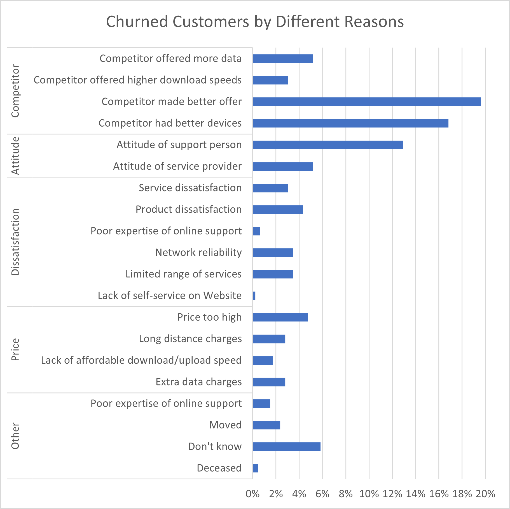
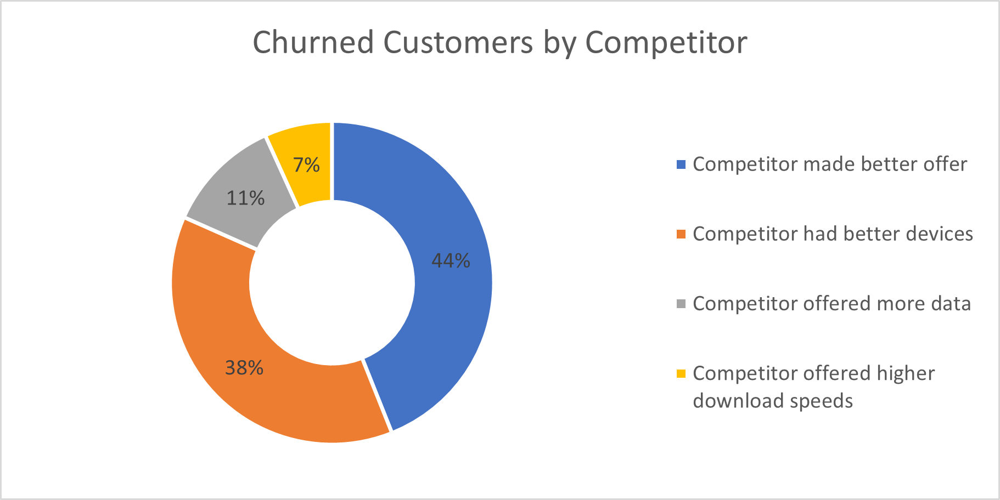
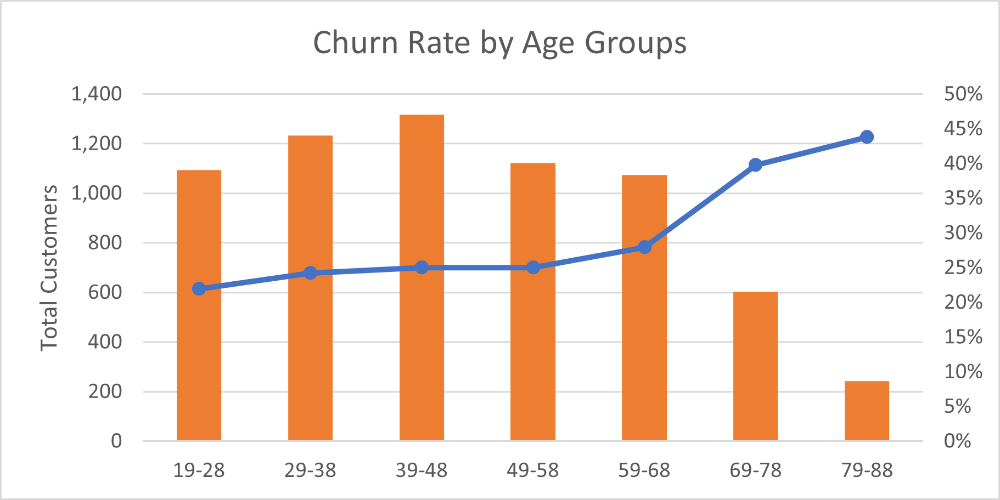
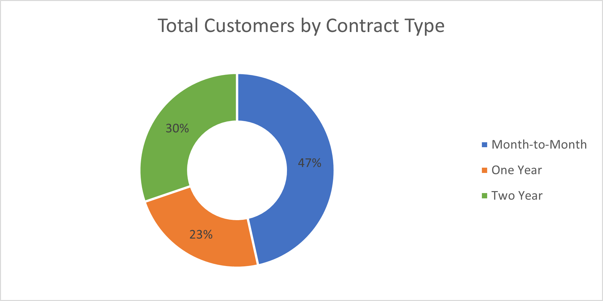
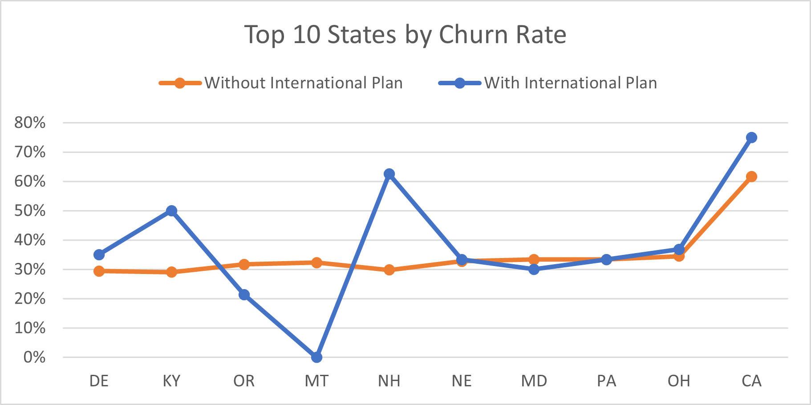

# Costumer Churn in Telecommunications

## Introduction
Customer churn is a critical issue for telecommunication companies, as it directly impacts revenue and growth. Understanding the factors that drive customers to leave can help companies develop strategies to improve retention. This analysis explores various aspects of customer churn in a telecommunications company, including demographic factors, data consumption patterns, and contract types. By examining these elements, we aim to identify key drivers of churn and provide actionable insights to reduce customer attrition.

### Questions to Explore
1. What are the main reasons for customer churn?
2. Is there a relationship between customer age and churn rate?
3. Do data usage patterns influence customer churn?
4. What effect do account age and contract length have on churn rates?
5. How does having an international plan affect churn rates?

### Dataset Description

#### Customer status:
| **Field Name**       | **Description**                                                                 |
|----------------------|---------------------------------------------------------------------------------|
| **Customer ID**      | The unique ID that identifies a customer.                                       |
| **Churn Label**      | Contains "Yes" or "No" to indicate if a customer churned.                       |
| **Churn Category**   | Groups multiple churn reasons together for analysis purposes.                   |
| **Churn Reason**     | The particular reason why the customer ended the contract.                      |

#### Demographics:
| **Field Name**       | **Description**                                                                  |
|----------------------|----------------------------------------------------------------------------------|
| **Gender**           | The gender of the customer, indicated by "Male", "Female" or "Prefer not to say".|
| **Age**              | The age of the customer.                                                         |
| **Under 30**         | Indicates if the customer is under 30 with "Yes" or "No".                        |
| **Senior**           | Indicates if the customer is above 65 with "Yes" or "No".                        |

#### Contract information:
| **Field Name**                   | **Description**                                                                      |
|----------------------------------|--------------------------------------------------------------------------------------|
| **Contract Type**                | Contains "Month to Month", "One Year" or "Two Year".                                 |
| **Payment Method**               | Preferred payment method of the customer indicated with "Credit Card", "Direct Debit" or "Paper Check".|
| **State**                        | The code of the state where the customer lives.                                       |
| **Phone Number**                 | Phone number of the customer.                                                         |
| **Group**                        | Indicates if the customer is part of a group contract. A group contract offers advantages and is generally cheaper. Contains "Yes" or "No".|
| **Number of customers in a group** | Number of customers part of the group.                                               |

#### Subscription types & Charges:
| **Field Name**                            | **Description**                                                                  |
|-------------------------------------------|----------------------------------------------------------------------------------|
| **Account Length (in months)**            | The number of months the customer has been with Databel.                          |
| **Local Calls**                           | Amount of local (within the US) calls from the customer.                          |
| **Local Mins**                            | The number of minutes spent calling locally.                                      |
| **Intl Calls**                            | Amount of international (outside the US) calls from the customer.                 |
| **Intl Mins**                             | The number of minutes spent calling internationally. |
| **Intl Active**                           | Indicates if the customer called internationally with a "Yes" or "No".            |
| **Intl Plan**                             | Indicates if the customer has a premium plan to call internationally for free with "Yes" or "No". This premium is reflected in the amount of the monthly charge.|
| **Extra International Charges**           | Contains the extra charges for international calls for customers who are not on an international plan.|
| **Customer Service Calls**                | The number of calls made to customer service.                                     |
| **Avg Monthly GB Download**               | Contains the average monthly download volume in gigabytes.                        |
| **Unlimited Data Plan**                        | Indicates if the customer has free unlimited download capacity with "Yes" or "No". This premium is reflected in the amount of the monthly charge.|
| **Extra Data Charges**                    | Contains the extra charges for data downloads for customers who are not on an unlimited plan.|
| **Device Protection & Online Backup**     | Indicates if the customer has paid for device protection and backup with "Yes" or "No".|
| **Monthly Charges**                       | Average of all monthly charges to the customer.                                   |
| **Total Charges**                         | Sum of all monthly charges.                                                       |

## What are the main reasons for customer churn?

*The pie chart shows percentages of churned customers in the 'Competitor' group.*

Competitor-related factors are the primary drivers of customer churn. Specifically, 20% of total churned customers left because a competitor made a better offer, while 17% switched due to competitors having better devices. Other significant factors include the attitude of support personnel (13%) and price-related issues (12%). This suggests that the company needs to focus on improving its competitive offerings, device quality, customer support, and pricing strategies to reduce churn.

## Is there a relationship between customer age and churn rate?

There is a clear trend of increasing churn rates with customer age. The churn rate rises from 22% for the 19-28 age group to 44% for the 79-88 age group. However, the total number of customers is highest in the middle age ranges (29-58), with fewer customers in the youngest and oldest groups. This suggests that while older customers are more likely to churn, they represent a smaller portion of the customer base. The company needs to investigate further why older customers have higher churn rates and might want to develop targeted retention strategies for them while also focusing on the larger middle-aged customer segments.

## Do data usage patterns influence customer churn?

.png)
.png)

The majority of customers use less than 5 GB of data per month. Interestingly, customers without unlimited data plans have lower churn rates (16%) compared to those with unlimited plans (32%). However, for very high data users (40-45 GB), those without unlimited plans have very high churn rates (100%) compared to those with unlimited plans which have low churn rates (21%). This suggests that while unlimited plans may not be necessary for most customers, they are crucial for retaining high-data users. The company might consider offering tiered data plans to better match customer needs and reduce overall churn.

## What effect do account age and contract length have on churn rates?

_and_contract_type.png)

The data shows that month-to-month contracts have significantly higher churn rates (74%) compared to one-year (12%) and two-year (3%) contracts. Churn rates are particularly high for newer accounts on month-to-month contracts, with 82% churn for accounts aged 1-12 months. As account age increases, churn rates generally decrease across all contract types. This indicates that encouraging customers to sign longer-term contracts and focusing on retaining customers through their first year could significantly reduce churn.

## How does having an international plan affect churn rates?

In most states, customers with international plans have higher churn rates than those without. The difference is particularly pronounced in states like KY (50% vs 29%) and NH (63% vs 30%). However, some states like MT show the opposite trend with lower churn rates for those with international plans (0% vs 32%). This suggests that the international plan may not be meeting customer needs in many states, and the company should investigate why it's leading to higher churn rates, possibly by reviewing the plan's features and pricing in different regions.
